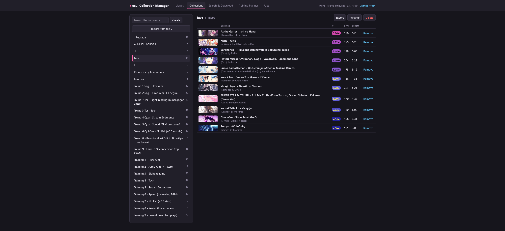
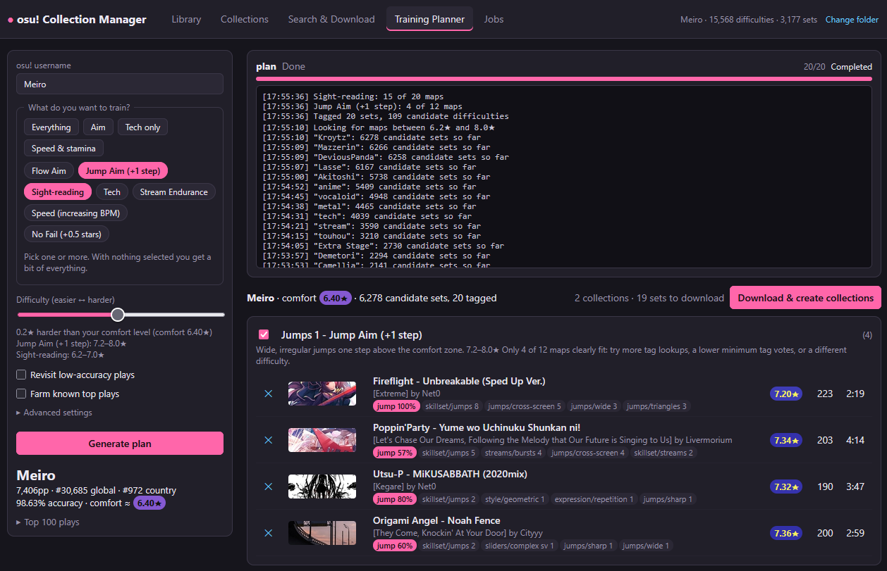

# osu! Collection Manager

A small local web app for **osu!stable** on Windows. It reads your `osu!.db`, manages `collection.db`, downloads
beatmaps from public mirrors and builds training collections from your profile.

It runs only on your own PC: a small server listens on `localhost` and your browser is the interface. Nothing is hosted
anywhere and you don't need an osu! API key.

## What it does

| Tab | What you can do |
|---|---|
| **Library** | Browse and filter every difficulty installed in osu! (stars, BPM, length, last played) and add a selection to a collection. |
| **Collections** | View, create, rename and delete collections, remove maps, **export** a collection to a `.json` file and **import** one back. If some maps of an imported file aren't in your library, the app offers to look them up online and download them. |
| **Search & Download** | Search the beatmap mirror, preview the audio, open a map's page on osu!, and download the selected sets (optionally straight into a collection). |
| **Training Planner** | Reads your public profile, estimates your comfort star rating and proposes training collections. You choose what to train (flow aim, jumps, tech, streams, speed, ...), how hard, and can split a focus into difficulty tiers. Review the plan (rename, untick or remove maps), then apply it to download the maps and write the collections. |
| **Jobs** | Progress and logs of downloads, imports and plan generation. |

On the first start the app looks for your osu! folder by itself, or asks you for it (see [First run](#first-run)).

## Screenshots





## What you need

**To run a release build (the zip with the `.exe`):**

- Windows 10 or 11
- osu!stable installed (the folder that contains `osu!.db` and `Songs`)
- An internet connection for downloads, search and the Training Planner
- Nothing else — the release includes the .NET runtime

**To run from source:**

- Windows 10 or 11
- [.NET 10 SDK](https://dotnet.microsoft.com/download)
- osu!stable and an internet connection, as above

osu!lazer is not supported: it stores its data in a different format.

## How to run

### From a release build

1. Unzip the release anywhere.
2. Double-click `osu_collection_manager.exe`.
3. A console window opens (it *is* the app: close it to quit) and your browser opens `http://localhost:5178`.

Starting it a second time just opens the browser tab of the copy that is already running.
Windows SmartScreen may warn about an unsigned app the first time; choose **More info → Run anyway**.

### From source

```
dotnet run --project src
```

The console prints the address to open (`dotnet run` also opens the browser for you).

### Build a release yourself

```
.\publish.ps1
```

This produces a self-contained single-file executable and a zip in `dist\`. The zip contains the `.exe`, the `wwwroot`
folder and `appsettings.json`; they must stay together.

### Options

Pass these on the command line (`osu_collection_manager.exe --no-browser`, or `dotnet run --project src -- --no-browser`):

| Option | Meaning |
|---|---|
| `--no-browser` | Don't open the browser automatically. |
| `--urls=http://localhost:5555` | Use another address/port (default `http://localhost:5178` from `src/appsettings.json`). |
| `--OsuPath="C:\path\to\osu!"` | Use this osu! folder instead of detecting or asking. |
| `--AutoDetect=false` | Don't try to find osu! automatically. |

## First run

The app needs the folder that contains `osu!.db`. It looks in this order:

1. `--OsuPath=...` if you passed it.
2. The folder you chose last time (saved in `%LOCALAPPDATA%\OsuCollectionManager\settings.json`).
3. Automatic detection: a running osu!, then the Windows registry, then the usual install folders on your local drives.

If it can't decide, a **"Where is your osu! folder?"** dialog opens with the folders it found, a **Browse…** button
(click through your drives and folders; folders that contain `osu!.db` are marked) and a box to paste a path. Your choice
is remembered. You can change it any time with **Change folder** in the top-right corner.

## Good to know

- **Close osu! before changing collections.** osu! rewrites `collection.db` when it exits, so the app refuses to write
  while `osu!.exe` is running.
- Every change to `collection.db` first saves a backup next to it (`collection.db.bak-<date>`).
- Downloaded `.osz` files go to your `Songs` folder; osu! imports them the next time it starts. Until then their maps show
  up as "missing" in collections.
- Map data comes from the public osu! website (profile, top plays, community tags) and beatmap mirrors such as
  osu.direct. Requests are rate limited to be polite; if a site answers "429", wait a minute and try again.
- The server only answers requests for `localhost` and rejects writes coming from other websites.

## Project layout

```
src/                            everything the app is made of
  Program.cs                    startup, API endpoints, single-instance + browser launch
  Osu/                          osu!.db reader and collection.db reader/writer
  Services/                     osu! folder detection, mirror and website clients, planner, importer, job manager
  Properties/, appsettings.json, osu_collection_manager.csproj
  wwwroot/                      the web page (plain HTML, CSS and JavaScript modules, no build step)
    index.html
    css/                        one stylesheet per area (base, layout, library, search, planner, ...)
    js/                         one module per tab (library, collections, search, planner, jobs, setup) plus core/ helpers
publish.ps1                     builds the release executable and zip
```

The C# code serves `src/wwwroot` as static files and exposes the JSON API under `/api`.
When developing, edit the files in `src/wwwroot/` and just refresh the browser.

| Piece | File |
|---|---|
| `osu!.db` reader (handles the float32 star ratings of db version 20250107 and later) | `src/Osu/OsuDatabase.cs` |
| `collection.db` read/write, atomic write and timestamped backup | `src/Osu/CollectionDatabase.cs` |
| osu! folder detection | `src/Services/OsuLocator.cs`, `OsuInstall.cs` |
| Mirror search, downloads with fallback and validation | `src/Services/MirrorClient.cs` |
| Profile, top plays and beatmap tags from public osu.ppy.sh pages (no API key) | `src/Services/OsuWebClient.cs` |
| Collection import and restore | `src/Services/CollectionImporter.cs` |
| Training categories and map selection | `src/Services/TrainingPlanner.cs` |
